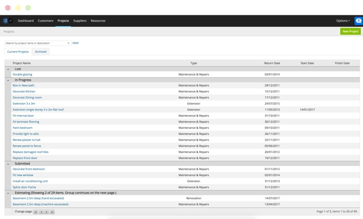

A web-based application that enabled building companies and tradesmen to create estimates and tender documents, whilst also automatically calculating the most efficient cost for resources used in their projects.

## Features

* Facility to manage:
  * Projects
  * Customers
  * Suppliers
  * Resources
* Support ticketing system
* Cost-efficiency algorithm

The key features of the Buildmate application allowed Users to manage a number of aspects of their projects and customer base. In addition to the typical features expected when creating and managing building projects and customers, the system included an algorithm to calculate the most cost-efficient way to purchase resources.

### Cost-efficiency
When adding a resource to a project, Buildmate's cost-efficiency algorithm would automatically check if the resource already existed in the project. It would then check the total resource value against the purchase quantities available and automatically use the most cost-effective combinations.

As an example, a project uses **15mm nail fix pipe clips**, these clips are used in a number of different tasks and are used in sets of **20-30** at a time. These resources are usually sold in packs of either **50** or **200**, where larger quantity packs are more cost-effective.

The Buildmate system would look at all the tasks in the project and calculate that there were **150 clips** required across the whole project. It then scanned the resource pack sizes to calculate whether it was more efficient to buy **3 packs of 50 clips** or **1 pack of 200 clips** while still having **50 clips left over**.