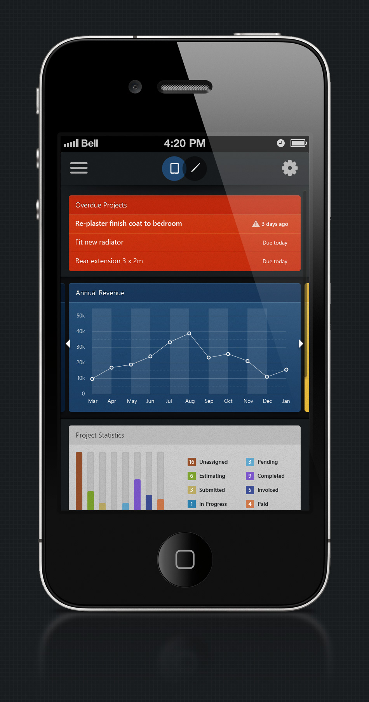

Created in photoshop and designed for mobile devices, this concept design was put together to illustrate the requirements of a project dashboard for the
<a href="/buildmate-app" class="text-primary-dark no-underline hover:underline hover:text-primary-light">Buildmate web application</a>.

As a dashboard the concept design needed to display convenient alerts and a high-level overview indicating the general health of projects across the users account. The main focus was therefore the Overdue Projects section at the top of the app. This area immediately brings into focus any estimates that are overdue or are expected to be returned to a customer imminently.

Below this, Annual Revenue gives a general sense of the financial health of all projects over the preceding 12 month period. The final section of the design displays all current project Status totals and gives Users a quick indication of their current workload, this is particularly important if too many projects are still left in Unassigned. The idea behind the status system being that this should act as a working process where projects move through Estimating and back to the customer as an official estimate as soon as possible.