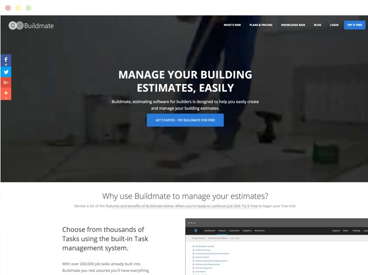

> **Source code:** [https://github.com/functionfirst/buildmate-website](https://github.com/functionfirst/buildmate-website)

A marketing focused website designed to promote the Buildmate web application which supported builders and tradesmen by simplifying the creation and management of their projects and customer base.

## Features

* Static content
* Simple contact form
* Blogs
* Knowledge Base
* Admin management for Blogs & Knowledege Base articles

I designed and built a marketing website populated with a mix of static and dynamically generated content. While the content and feature pages were staticly managed, I also implemented a Blog and Knowledge base system to provide support to existing customers as well as providing quality content to contribute to the effectiveness of search engine optimisation.
