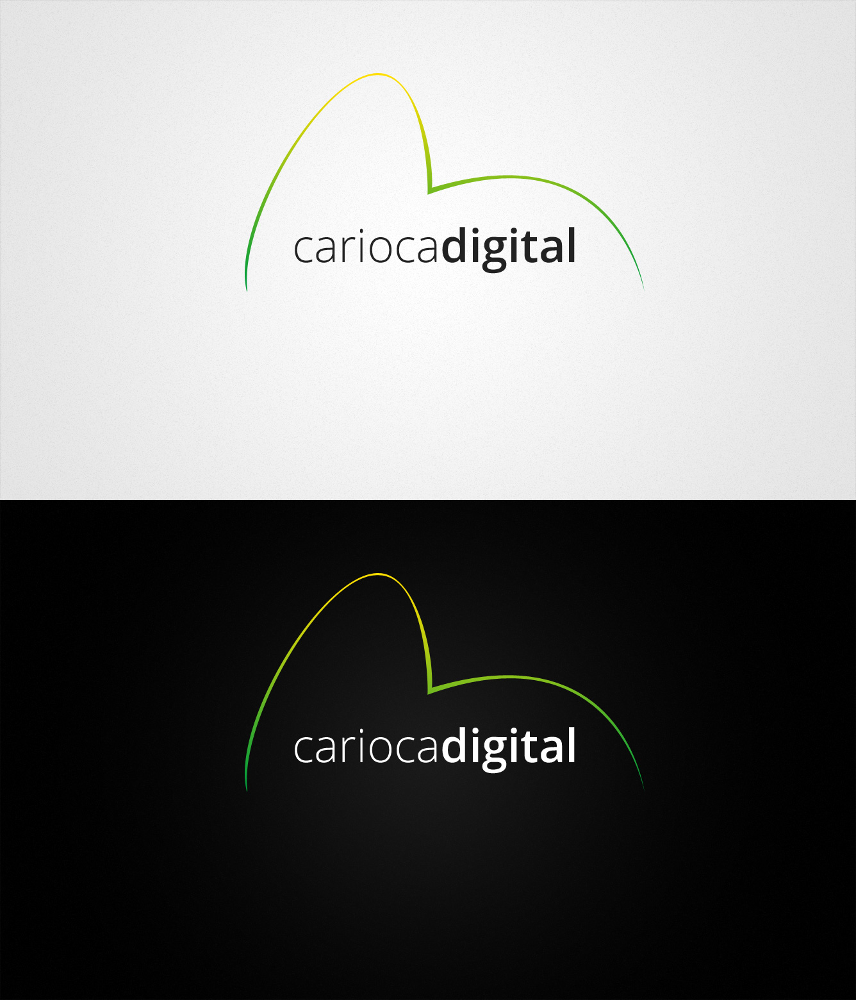

Concept design and creation of a logo for Carioca Digital, an IT provider and digital agency based in Rio de Janeiro, Brazil.

Using the iconic sugarloaf mountain as inspiration while also drawing on the bright, vibrant colours on display at the Carnaval do Brasil I was able to create a simple but effective logo for Carioca Digital.

