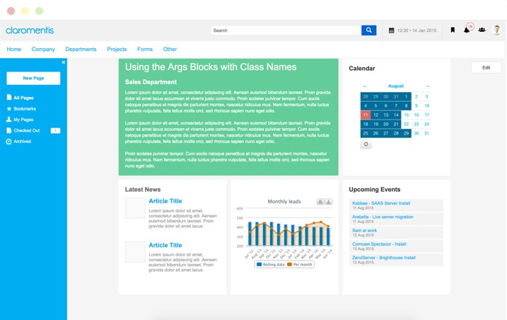
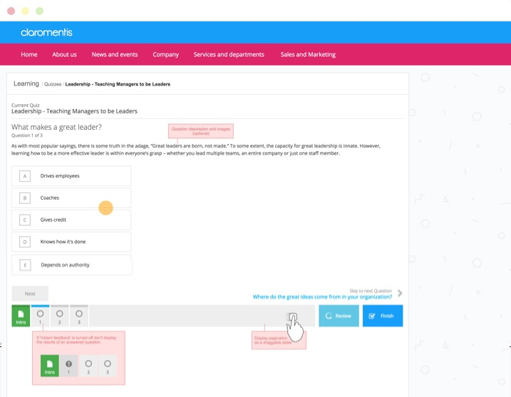
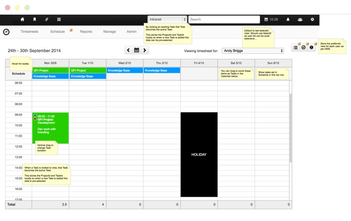

As the Product Manager for the folks at Claromentis in Brighton I was in charge of the Product team which was composed of both Designers and Developers working together on the core product platform.

## Process changes
During my time at Claromentis I was responsible for coordinating the design team and establishing a solid foundation for the front-end of the system. As part of this role and as Product Manager I implemented a number of key process changes to improve efficiency.

## Prototyping
Introduced interactive low fidelity prototyping to the organisation. Prior to my joining Claromentis any specificaiton for developers was illustrated using static screenshots built in Photoshop. I introduced the existing team to Axure and the benefits of using HTMl & CSS to prototype their ideas.

By changing the process in this way Developers were able to more easily understand the project requirements, interacting with the prototype offered them a clearer and deeper understanding of how the UI should work.

### Bootstrap Foundations
When I arrived there were no established guidelines for design and front-end and the framework itself was still using an outdated table-based layout. Each module of the system was designed independently and as a result were often inconsistent in both design and user experience. There were also significant problems with the existing codebase as duplicate, heavy and extremely customised CSS was rife throughout the system.

Given the size and complexity of the existing codebase I opted to implement Bootstrap as a foundatin layer from which we could build the front-end. I also defined some simple front-end guidelines which included the blacklisting of ID's as css selectors and !important in css properties. Javascript could only be hooked upto ID's or CSS classes prefixed with js-, these classes were to be exclusively used by javascript and no style properties were to be applied.

By implementing this we very quickly reduced the amount of code we had to maintain as well as bring much more consistency to design and interaction across all modules.

### CVS to GIT
I championed the migration of our codebase from CVS to GIT. This lead to better code management and more collaborative working thanks to the more robust branching system. This lead to more flexible releases as developers could work on feature branches without affecting the release of bugs and other quick fixes due to commiting to the master branch.

## Prototypes
As Product Manager and Senior UI Designer for Claromentis I created a number of key prototypes. These were designed to be additional modules which could be added onto the core Claromentis offering, these modules offered further specialisation in areas where customers needed better support.

### Pages (2016)
This is the initial prototype for Pages, a new Claromentis module which was designed to replace the existing but outdated CMS module. Pages was designed to be plug-and-play, allowing new components to be simply dragged into place on the page while also allowing for existing modules to be reconfigured using contextual option panels.

<a href="http://prototypes.claromentis.net/pages2/" class="text-primary-dark no-underline hover:text-primary-light" target="_blank">View Pages Prototype &rarr;</a>

### Quiz Builder (2016)
In addition to offering support for Learning packages built using SCORM, Claromentis also needed to developer it's offering further into the Learning Management Systems (LMS) space. With that in mind I began researching and implementing a Quiz Builder module which would allow clients not familiar with building SCORM packages. The Quiz Builder itself allowed administrators to create new quizzes, ask questions and track results and other data.

<a href="http://prototypes.claromentis.net/quiz/" class="text-primary-dark no-underline hover:text-primary-light" target="_blank">View Quiz Builder Prototype &rarr;</a>

### Timesheets - Prototype (2014)
This is a low-fidelity prototype for a Timesheet module based on the Claromentis framework. Built using Axure, this module explored the requirements that would allow Project Managers to schedule team diaries, as well as allowing team members to record their time against these activities.

Given further time for research and development, the prototype could have been extended to offer an improved reporting system that would allow project managers to track progress and identify any project delays.

<a href="http://prototypes.claromentis.net/timesheets/" class="text-primary-dark no-underline hover:text-primary-light" target="_blank">View Timesheets Prototype &rarr;</a>

