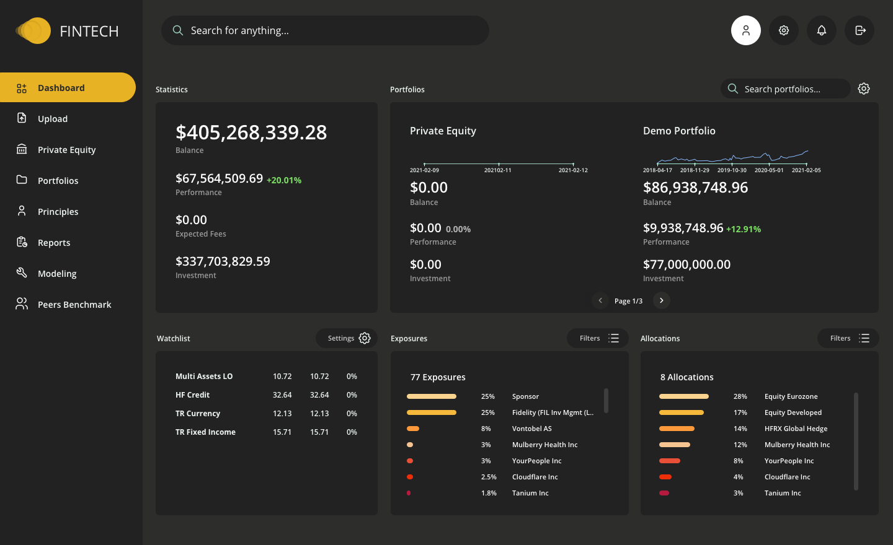
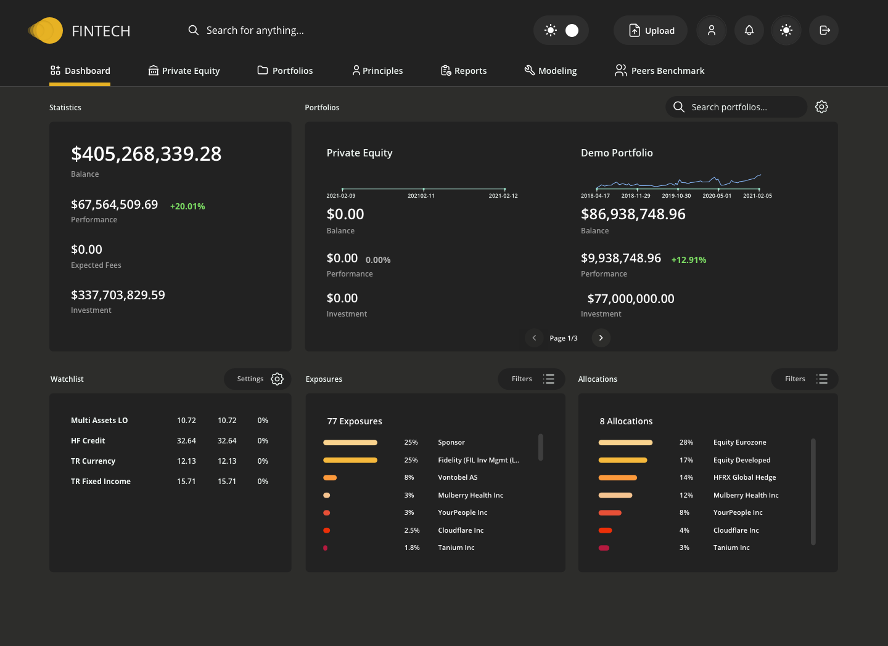
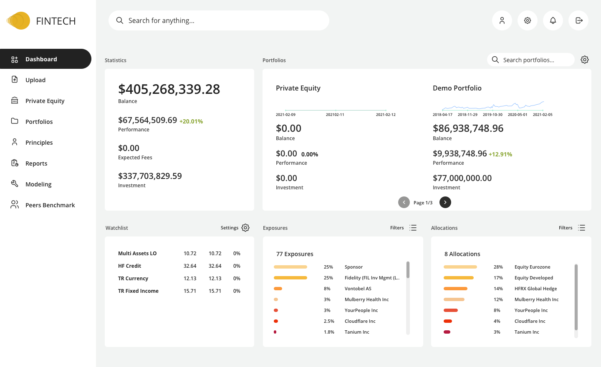

Following a successful round of interviews, the following designs were put together to explore possible visual UI improvements for a financial technology company who's clients include institutional allocators, family offices and banks.

  
Fig 1. Dashboard with left-hand navigation (Dark mode)

  
Fig 2. Dashboard with horizontal navigation (Dark mode)

  
Fig 3. Dashboard with left-hand navigation (Light mode)

