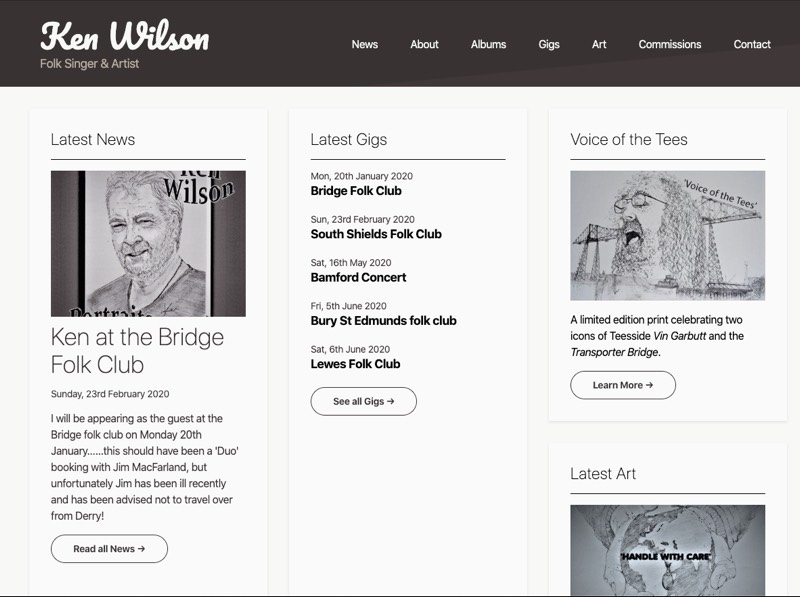

This project was a typical promotional website built for Ken Wilson, a traditional folk singer and pencil sketch artist.

## Challenges & Requirements
There were two key aspects to the project, firstly to promote Ken as folk singer and artist, and secondly to facility the sale of his art prints online.

As a personal project to help a family member get online the emphasis for me was on minimising costs while building the site as quickly and efficiently as possible. The site also needed a CMS system to allow Ken to manage the website content going forward.

Since he wanted to be able to sell online, it would also need integratiing with a payment provider in order to take online payments. Due to time-constraints and the need for simplicity, [PayPal Button's](https://www.paypal.com/buttons/) fit the bill perfectly.

## Actions & Outcomes

* **Static Site Generator.** Offers unparalleled performance metrics out of the box. With a background in Vue.js my Static Site Generator of choice is [Gridsome](https://gridsome.org/).

* **Content Management.** Using [Netlify CMS](https://www.netlifycms.org/) we're able to create static content using a customisable WYSIWIG to create and edit Markdown files.

* **Hosted.** With [Netlify's](https://netlify.com/) free-tier hosting static websites the projects ongoing costs were kept extremely low.

* **Online Payments**. Fulfilled using Paypal Button's, the Vue.js front-end could be configured to offer Users options such as Canvas, Poster, and print size relatively easily.

## Conclusions
Having heard a lot about the benefits of Static Site Generators I used this project as an opportunity to learn more. With a background in [Vue.js](https://vuejs.org/) it made perfect sense to try out [Gridsome](https://gridsome.org/), a static site generator built with Vue.js.

It's fair to say I was blown away by the ease with which you can create a dynamic website like this. Particularly when combined with Vue's Single-Page Components and Tailwind CSS' atomic css classes.

As a result of the benefits I saw whilst building this project I championed the use of the JAM stack in my day job at [Visualsoft](https://www.visualsoft.co.uk/). As a result, I was very quickly put to work building Visualsoft's public facing [Roadmap website](/visualsoft-roadmap).

It also lead to me doing a presentation at Visualsoft's monthly internal Front-end talks called **A Vue to a kill(er pipeline)**.