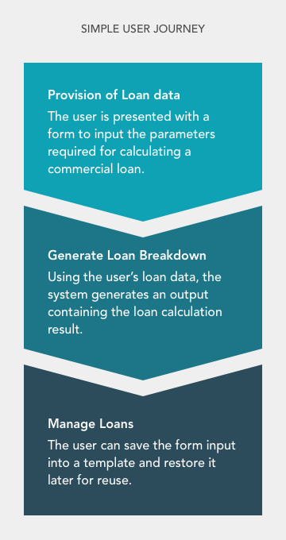
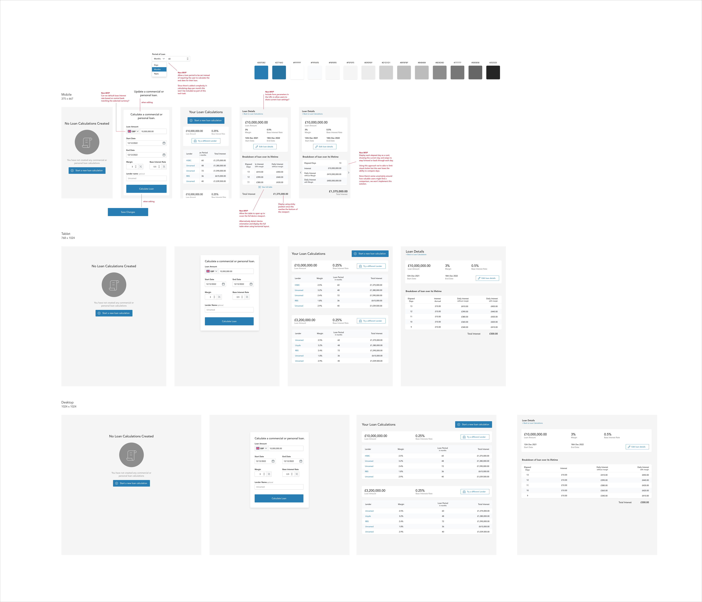

This project was a technical assignment for a job application in the fintech industry. The assigned task was to provide UX/Product Design as well as the front-end build for a bank loan calculator.

<div class="float-right md:ml-6">

[](./images/loan_user_journey.png)

<div class="-mt-10">
  <p class="text-sm text-grey-darkest">Fig 1. Simple User Journey diagram</p>
</div>
</div>

## User Journey

The assignment began with a simple user journey which covered 3 main steps.

1. Provision of loan data by the user
2. Generating a breakdown of the loan
3. Management of existing loans

The purpose of the loan calculator was to allow for the quick comparison of loans offered by different financial institutions by providing data including, Loan Amount, Start Date, End Date, Margin, and Base Interest Rate. These inputs were to be used to calculate a Daily Interest rate with and without Margin, as well as Interest Accrual for each day of the loan. Using this daily breakdown, a final Total Interest value would then be provided.

The calculation was to use a simple interest formula:
```
Simple Interest = P × I × N
P = Principal
I = Daily interest rate
N = Number of days between payments
```

## Design
The design phase began with some simple sketches to document the requirements of the calculator. This primarily focused on capturing the users inputs going into the system.

Following this a full design was developed using Sketch. This started off with a mobile-first approach that captured all of the requirements from the user journey. Some additional notes were provided in this design phase to capture additional improvements that could be made to the product beyond the initial Minimum Viable Product. The complete design can be seen below:

[](./images/loan-calc.png)

<div class="-mt-10">
  <p class="text-sm text-grey-darkest">
    Fig 2. Complete mobile, tablet and desktop design.
    <a href="/assets/static/portfolio/images/loan-calc.png?width=2560&key=13764a3" target="_blank">View the full design</a>.
  </p>
</div>

## Features

The app was developed using Vue and Typescript while attempting to follow clean-code principles. The loan app includes:

- Onboarding prompts when no loan data exists
- Editable loan details
- "Try a different Lender" feature - allowing users to quickly create and compare loans from different financial institutions
- A simple seeder tool to generate/clear loan data allowing speedy exploration of the app
