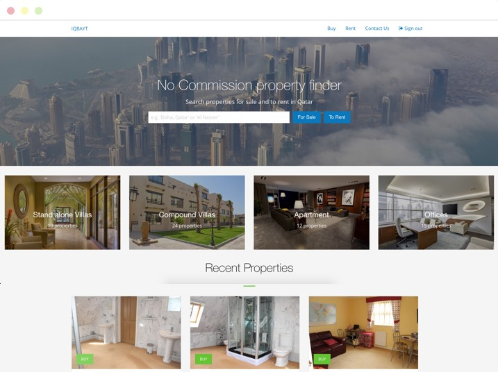

The project brief was to design and develop a property management portal to be launched in Qatar that would advertise property and land for sale or rent.

## Features

- CRUD Property Management
- User Registration & Management
- REST API with Token Based Authentication (JWT)
- Password Reset - also token based
- AWS S3 cloud storage - to store a potentially large quantity of property images

The project was developed as two independent front and back-end applications. The back-end application was built using NodeJS and ExpressJS as the main framework while MongooseJS was used as an object map to a MongoDB document store. Using these libraries I created a Rest API that was consumed by the Angular front-end.

Having taken an API first approach to this project, I was able to consume the API to create the front-end as a single-page web application using AngularJS. This allowed me to develop both applications in tandem while maintaining separation of concerns between the two. The structure of the Angular front-end code was influenced by [John Papa's Angular Style Guide](https://github.com/johnpapa/angular-styleguide/blob/master/a1/README.md).

## Conclusion 

In modern web development building with an API first approach allows you to consume your own API without any close coupling or dependencies between the two systems. There's also huge benefit for third-parties as they're able to integrate with your API using a technology of their choice, whether they're building a native or desktop app, or they're using a tech stack that doesn't match your own.
