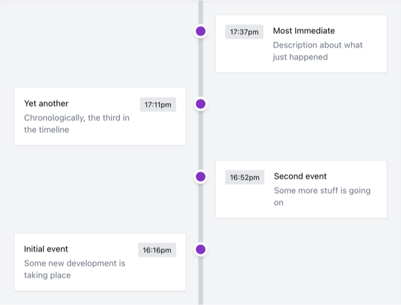

Small assignment for a technical interview. Required development of a simple react app that displayed a vertical event timeline.

The app should display 4 initial events then periodically add an additional event to the view. Only 5 events should ever be displayed at once, with the oldest events falling off the stack as a new event is added.

  
Fig 1. Screenshot showing for 4 initial timeline events

