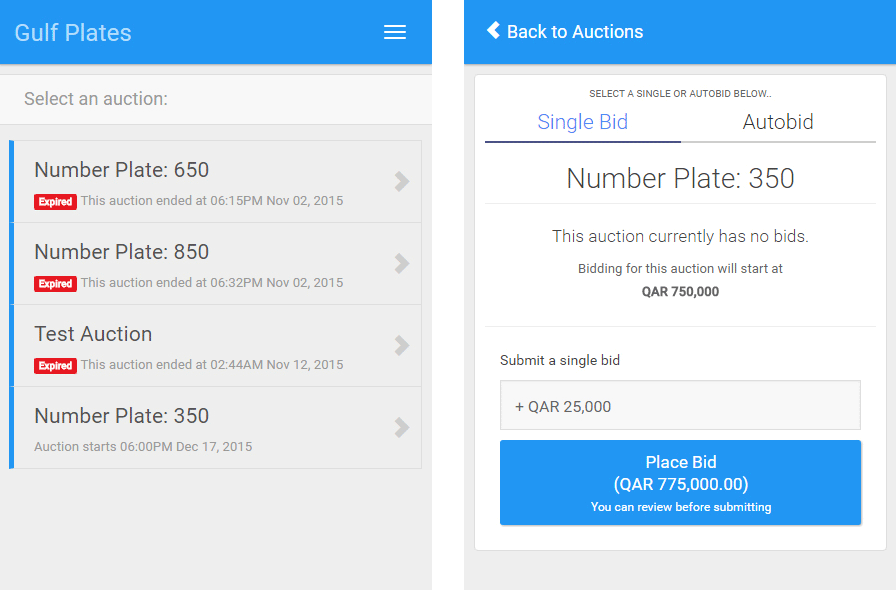
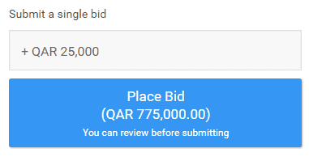
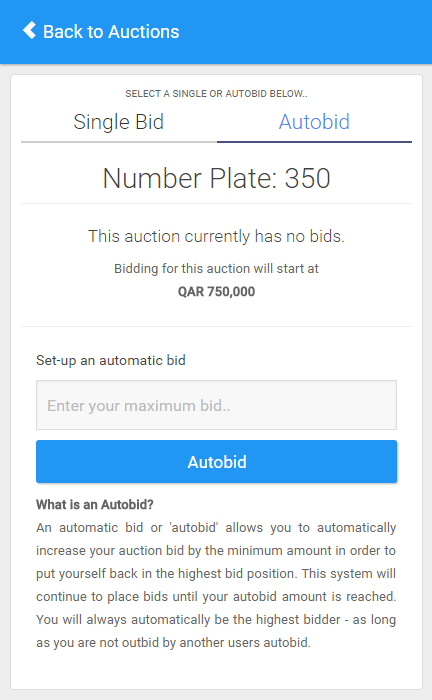

This real-time auction system was designed as a temporary one-shot app to facilitate the sale of a set of high-profile car number plates in Qatar.

## Features

- [Extended Bidding](#extended-bidding)
- [Incremental Bidding](#incremental-bidding)
- [Automated Bidding](#automated-bidding)
- Real-time Auctions (using Socket.io)
- Auction management
- User Registration & Management

Built on the MEAN stack, with AngularJS on the front-end working as a SPA (single-page application). The back-end was built with Node, Express and MongoDB to provide a Restful API which served auction data and managed user authentication. Socket.io was used to provide real-time bi-directional communication between the Angular SPA and the Express back-end.

### Extended bidding

Each auction could be configured with a scheduled finish and extension time, if a new bid was received during the closing minutes the auction finish time would be automatically extended by a pre-configured amount. This allowed users the opportunity to counter late bids and prevented auction **snipers** attempting to secure the item at a cheaper rate by placing a bid at the last minute or second.

### Incremental Bidding

Given the pressure and time sensitive nature of placing a bid, the UI was designed to be as simple and quick as possible to use.

  

Users were able to set an increment value from a select box. Using this increment value combined with the current auction value, a new bid value was automatically calculated. Keeping the increment value the same, the User could then simply click Place Bid using this new value. This reduced the bidding process to a single click.

### Automated Bidding

  

As incremental bidding still required constant attention on your auctions an Autobid system was also introduced to Gulf Plates. This allowed Users to set a maximum Bid value for the current auction. When other users placed a bid, the autobid system would check against any autobids logged in the system. Where these Autobids existed a new bid was automatically submitted on behalf of the user.

In situations where multiple autobids existed the internal system would identify the second highest Autobid and outbid it in favour of the user with the highest Autobid value.
