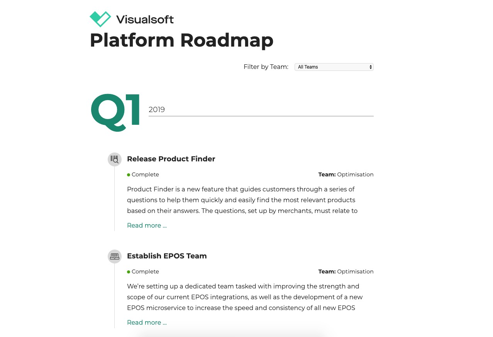
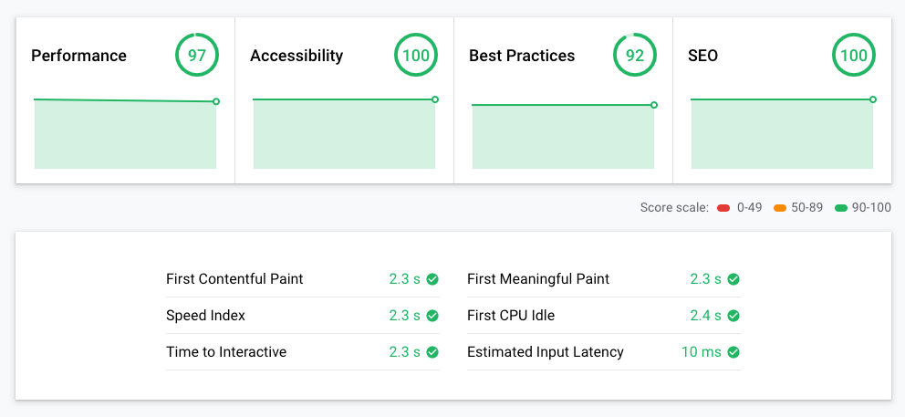

As an ecommerce platform it became increasingly important to Visualsoft that they share their development plans with customers.

## Challenges & Requirements
One aspect of this more transparent strategy meant the creation of a public facing Roadmap site that could be shared with customers. This would provide access to up-to-date information on product direction, a brief summary of individual features and their current status in the development process.

## Actions & Outcomes

Using Gridsome and Netlify, it was incredibly quick to put together a website that offered great performance metrics out of the box. Combining a Static Site Generator with Netlify's slick and intuitive integrations with Github deployments we were able to:

* Build & Deploy quickly
* Maintain the site easily
* Provide blazingly fast Performance

Gridsome's tagline is ["Fast by default"](https://gridsome.org/docs/fast-by-default/) and it didn't disappoint. 

## Conclusions
Looking at the performance screenshots taken from web.dev below it's easy to see why Static Site Generators and the [JAM Stack](https://jamstack.org/) are really shaking up the industry.

